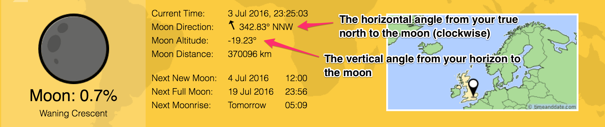

# Moon Sighting - Ramadan 2016

## What

A guide to sighting the new crescent moon.

## Why

The Islamic calender is based on the lunar cycle. Each new month is determined upon the sighting of the new crescent moon.

Following the islamic calender becomes particularly important to Muslims at the end of the month of Ramadan as a new moon indicates the start of the next month and the day of Eid.

During the Islamic Golden Age the Islamic world produced a number of mathematicians and astronomers [1]. It must have been a time when Muslims really felt a connection to the natural world and a deep curiosity in the complexities of God's creation.

> ### The sun and the moon [move] by precise calculation - Qur'an (55:5) [2]

Every year, for the past 2-3 years I've been saying to my cousin "we should go moon sighting to decide for ourselves when it's Eid". Each year I forget or I just don't do the necessary research to find out how to go about it. So this year I'm making the effort and sharing my (last minute) research here.

## How
### If you don't have time to read on, just read this section

If you're living in London, after sunset look low in the sky to the west. Check from 5th July - 6th July 2016. Inshallah it won't be too cloudy and your view won't obstructed by buildings!

Be wary of moonset times:

### Moon Watch project

HM Nautical Almanac Office is running a [Moon Watch project](http://astro.ukho.gov.uk/moonwatch/index.html) in which they provide information on the new moon and collect information from observations made by the public. It's pretty awesome that they recognise that there are religious communities who still have a key interest in the topic.

They've provided some really handy advice on where in the sky we should look out for the new crescent moon:

> The next new moon will occur on Monday July 4th 2016 at 11:01 GMT/UT (12:01 BST).

> ...northern Europe (including the British Isles) and Canada will probably have to wait until Wednesday July 6th to make their sightings of the new crescent moon

> If you go out just after sunset over the three or four days following the instant of new moon and have a look low in the western half of the sky near where the Sun set, you can try and observe the new crescent moon.

### Using timeanddate.com and Google Sky Mapper to track down that moon

Things you'll need:
- [Google Sky Map](https://play.google.com/store/apps/details?id=com.google.android.stardroid&hl=en) installed on your mobile device
- A compass

#### 1. Short guide to using timeanddate.com

Enter the name of your city on the [moonrise/moonset page](http://www.timeanddate.com/moon/uk)

You'll then see real-time information on the current phase of the moon where you live. To figure out roughly when  and where in the sky you should check for the moon have a look at the following 3 fields:

- Current time
- Moon Direction
- Moon Altitude

##### Moon Direction

The horizontal angle (clockwise) from your true north [4] to the moon - also known as the **azimuth** angle [3]. The little arrow tells you whether the moon will be east or west of North (but the angle tells you this anyway).

##### Moon Altitude

The vertical angle from your horizon to the moon. The altitude will vary if you have buildings other tall things obstructing your view. [3]

Here's a nice diagram illustrating the azimuth and altitude of a celestial body - Think of the two angles as coordinates for an object in the sky.

**For London**, in the timetable above we know that on 5th and 6th July 2016 the moon will be setting in the western part of the sky (about 290-300 degrees west of north). You can see the same timetable on the timeanddate website.

#### 2. Using your compass and Google Sky Map

Now that you know the Moon Direction (*) you can measure the angle from north and know which way to face.

Now, there are 3 things you can do here:

1. [Make your own astrolabe](http://cse.ssl.berkeley.edu/AtHomeAstronomy/activity_07.html) to measure your Moon altitude.

2. Launch your Google Sky Map app and hold up your mobile device in the direction of your Moon Direction (your compass will have told you which way to face).

  Slowly move your device up or down depending your Moon Altitude. i.e. if it's negative, move it down. You should soon see the moon appear on screen. Then you'll know exactly where the moon currently is in the sky. There's an example snap shot below.

3. Just guess how high to look in the sky based on your Moon Altitude. If the moon is visible that night you shouldn't really need your moon altitude. Hopefully just looking in the right direction will suffice.

Google Sky Map - The moon is black in this snap shot as it was a new moon at the time.

## Happy moon sighting and Eid Mubarak!

> ### "The universe is a piece of mathematics" - Marcus Du Sautoy

## Issues

If you have any questions/skepticisms/corrections on anything on this guide just raise an issue [here](https://github.com/tas12/moon-sighting/issues).

I'm a complete novice and am trying out moon sighting for the first time. Would be awesome if others could try it too and hopefully the skies will be clear.

(*) Since the Moon Direction is measured from your True North you might need to account for the current declination angle of your location [here](http://www.ngdc.noaa.gov/geomag-web/#declination). If you're in London you don't need to worry about it as currently the declination is only about 0.66° W  ± 0.37° and we don't have to be so accurate for this exercise.

## References

[1] [Really nice article on the Islamic Golden Age](http://www.electrummagazine.com/2012/11/muslim-astronomers-in-the-islamic-golden-age/)

[2] [Qur'an chapter 55](http://quran.com/55)

[3] [Using timeanddate moon pages](http://www.timeanddate.com/astronomy/moon/about-moon-calculator.html)

[4] [True north and magnetic declication](http://www.offroadtrailgeek.net/how_a_compass_works.html)
